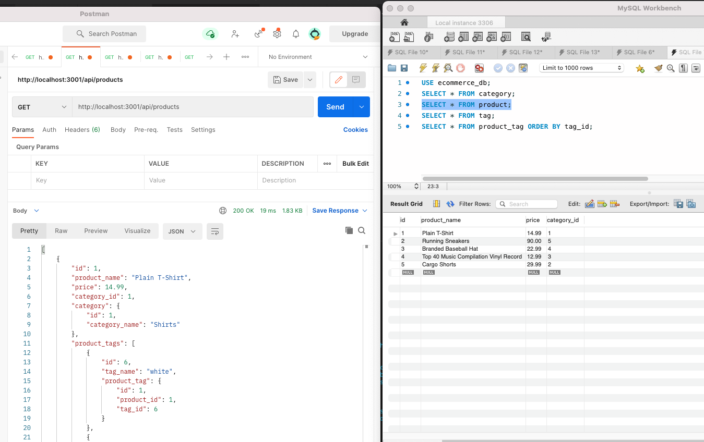

# e-commerce-backend
## Description

This project is a backend for an e-commerce site.  I hope to eventually adapt this project to be a backend for a tennis league management site.  The tennis league management site would have tables for teams, players, matches and a table that compiles the availability/status for each player for each match for the various teams.  Working on this backend project allowed me to learn how to create data models that sequelize can use to interface with the MySQL database so I don't have to generate a bunch of database sql statements.

## Table of Contents
- [Installation](#installation)
- [Usage](#usage)
- [Credits](#credits)
- [Questions](#questions)
- [License](#license)

## Installation
If someone wanted to install this project they would need to clone the repository from github to their machine.  Then they would need to run *npm install* to install all of the dependencies.  They would also need to edit the .env.EXAMPLE file with their username and password for their database.  Once that has been done they can run the command *mysql -u [username] -p < db/schema.sql* (entering the password when prompted) to create the database.  Then run the command *npm run seed* to seed the database with the sample data.  Finally, run *npm start* to start the application.  It will report which port it is listening on. The user can use POSTMAN or anyother similar tool to send URL's to the database to test it's functionality.  
## Usage

[Project Walk-through video (Part 1)](https://drive.google.com/file/d/1_4JW2ddp2HZ9_0ug2oI58Lo5Z7G72vFE/view)

[Project Walk-through video (Part 2)](https://drive.google.com/file/d/1H0z15Gz8_WVvL0G2LtCfV1iDAILX0cpl/view)

A user would use my project my sending URL requests to the server using the following routes:
- GET routes
    - http://localhost:3001/api/tags to list all of the product tags and the products that use each tag
    - http://localhost:3001/api/tags/tagId to list the product tag with the id tagId and the products that use that tag
    - http://localhost:3001/api/products to list all of the products and the tags that the products use
    - http://localhost:3001/api/products/productId to list the product with the id productId and the tags that the product uses
    - http://localhost:3001/api/categories to list all of the product categories and the products that are in that category
    - http://localhost:3001/api/categories/categoryId to list the category with the id categoryId and the products that are in that category
- POST routes
    - http://localhost:3001/api/tags to creaete a new tag (using JSON { "category_name":"Sunglasses"}, for example)
    - http://localhost:3001/api/products to create a new product in the database (using JSON {
    "product_name": "Basketball",
    "price": 200.00,
    "category_id": 6,
    "stock": 3,
    "tagIds": [1, 2, 3, 4]
}, for example)
    - http://localhost:3001/api/categories to create a new category in the database (using JSON {
    "tag_name": "pink"
}, for example)
- DELETE routes
    - http://localhost:3001/api/tags/tagId to delete the product tag with the id tagId
    - http://localhost:3001/api/products/productId to delete the product with the id productId
    - http://localhost:3001/api/categories/categoryId to delete the category with the id categoryId

## Credits
This project uses the MySQL database as its database.  Node.js is used to run JavaScript on the server (outside of a client).  Express server is used to build the web server and I have used the module Sequelize to interface with the database, the module dotenv to secure my database credentials outside of the repository and project code, and the MySQL2 module to allow Sequelize to interface with MySQL.
## Questions
If you have any questions you can contact the author through his github user profile: https://github.com/bdstpierre
or by sending an email to barry@stpierre.com
## License
Copyright 2021 Barry St. Pierre

    Permission is hereby granted, free of charge, to any person obtaining a copy of this software and associated documentation files (the "Software"), to deal in the Software without restriction, including without limitation the rights to use, copy, modify, merge, publish, distribute, sublicense, and/or sell copies of the Software, and to permit persons to whom the Software is furnished to do so, subject to the following conditions:
    
    The above copyright notice and this permission notice shall be included in all copies or substantial portions of the Software.
    
    THE SOFTWARE IS PROVIDED "AS IS", WITHOUT WARRANTY OF ANY KIND, EXPRESS OR IMPLIED, INCLUDING BUT NOT LIMITED TO THE WARRANTIES OF MERCHANTABILITY, FITNESS FOR A PARTICULAR PURPOSE AND NONINFRINGEMENT. IN NO EVENT SHALL THE AUTHORS OR COPYRIGHT HOLDERS BE LIABLE FOR ANY CLAIM, DAMAGES OR OTHER LIABILITY, WHETHER IN AN ACTION OF CONTRACT, TORT OR OTHERWISE, ARISING FROM, OUT OF OR IN CONNECTION WITH THE SOFTWARE OR THE USE OR OTHER DEALINGS IN THE SOFTWARE.

